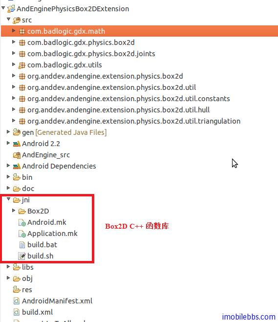
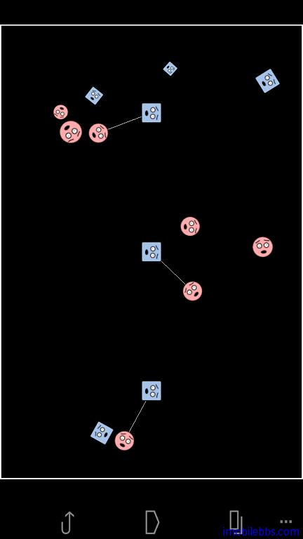

# Android NDK 开发教程八：Box2D 的 Android NDK 实现

Box2D 是一个用于游戏的 2D 刚体仿真库。程序员可以在他们的游戏里使用它，它可以使物体的运动更加可信，让世界看起来更具交互性。从游戏的视角来看，物理引擎就是一个程序性动画(procedural animation)的系统，而不是由动画师去移动你的物体。你可以让牛顿来做导演。

Box2D 是用可移植的 C++ 来写成的。因此也可以通过 Android NDK 将它引用到 Android 平台，从而也可以在 Android 平台使用 Box2D 引擎来编写游戏。

这里介绍的是基于 [AndEngine](http://www.andengine.org/) 的 Box2D 库的扩展，它就是通过 NDK 将 Box2D C++ 函数通过 JNI 实现了对应的 Java 接口。源码可以从 http://code.google.com/p/andengine/ 下载，或是从[本地下载](http://www.imobilebbs.com/download/android/AndEngine.rar) (210 MM 包括所有源码及示例）。

src 目录提供了 Box2D 的 Java 接口，主要是通过调用 native Box2D C++函数库来实现。NDK 最常见的用法是将一些 C/C++函数库移植到 Java 平台，而不是直接用来写 Android 应用。

这是使用 Box2D 函数库实现的一个实例 PhysicsRevoluteJointExample，源码在上面 tar 包中。性能相当不错。

可以参考其中 Android.mk 文件的内容。

后面将专门介绍 AndEngine 开发包，如果你对写手机游戏感兴趣的话，请留意我们的博客。

Tags: [Android](http://www.imobilebbs.com/wordpress/archives/tag/android), [NDK](http://www.imobilebbs.com/wordpress/archives/tag/ndk)