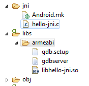

# Android NDK 開發教程三：Hello JNI 示例

Android NDK 開發包帶有不少例子，一個簡單的例子 Hello-Jni ，介紹了如何使用 Java 調用 C 函數。

1. 可以使用 Eclipse 的 import 將該項目添加到工作目錄中.

該項目目錄結構如下：

├── AndroidManifest.xml  
├── default.properties  
├── hellojni.txt  
├── jni  
│   ├── Android.mk  
│   └── hello-jni.c  
├── res  
│   └── values  
│       └── strings.xml  
├── src  
│   └── com  
│       └── example  
│           └── hellojni  
│               └── HelloJni.java  
└── tests  
├── AndroidManifest.xml  
├── default.properties  
└── src  
└── com  
└── example  
└── HelloJni  
└── HelloJniTest.java  

上面列出使用 NDK 開發項目的基本的目錄結構，C 代碼一般放在 jni 目錄下。

2.編譯 Native Code

i) 在命令行（Windows 環境下使用 Cygwin 的命令行） ，將當前目錄改動到 <ndk-root>/samples/hello-jni

ii) 生成 build.xml

android update project -p . -s  (註：Windows 下可能需要  使用 android.bat )

iii) 編譯 C 代碼

```

    cd <ndk-root>/samples/hello-jni

    <ndk_root>/ndk-build

```

3.下面就可以使用 Eclipse 編譯運行 Hello Jni.


編寫 NDK 的一般步驟，

1.參考 Hello-Jni ，修改 jni/Android.mk 文件，將所要編譯的文件改成自己的文件。

LOCAL_PATH := $(call my-dir)

include $(CLEAR_VARS)

`LOCAL_MODULE    := hello-jni`
`LOCAL_SRC_FILES := hello-jni.c`

include $(BUILD_SHARED_LIBRARY)

2.定義 Native 函數，如HelloJni 中

public native String  stringFromJNI();

3.在 Eclipse 中編譯該項目，注意此時，你無需定義對於的 Native 文件中 C 函數，因為手工定義對於的 C 函數很容易出錯，可以藉助 [javah](http://docs.oracle.com/javase/1.4.2/docs/tooldocs/windows/javah.html) 工具來完成（包括在 JDK 中）。

4. 使用 Javah 生成對應 C 函數定義

在命令行下  運行 javah com.example.hellojni.HelloJni

其中 com.example.hellojni 為包名，注意運行 Javah 的當前目錄 為 <ndk>/examples/hello-jni/bin/classes (你也可以使用 javah 的選項來指定 classpath).

正確運行好，Javah 產生 com_example_hellojni_HelloJni.h

定義如下：

```

    /* DO NOT EDIT THIS FILE - it is machine generated */
    #include &lt;jni.h&gt;
    /* Header for class com_example_hellojni_HelloJni */
    
    #ifndef _Included_com_example_hellojni_HelloJni
    #define _Included_com_example_hellojni_HelloJni
    #ifdef __cplusplus
    extern &quot;C&quot; {
    #endif
    /*
     * Class: com_example_hellojni_HelloJni
     * Method:stringFromJNI
     * Signature: ()Ljava/lang/String;
     */
    JNIEXPORT jstring JNICALL Java_com_example_hellojni_HelloJni_stringFromJNI
     (JNIEnv *, jobject);
    
    /*
     * Class: com_example_hellojni_HelloJni
     * Method:unimplementedStringFromJNI
     * Signature: ()Ljava/lang/String;
     */
    JNIEXPORT jstring JNICALL Java_com_example_hellojni_HelloJni_unimplementedStringFromJNI
     (JNIEnv *, jobject);
    
    #ifdef __cplusplus
    }
    #endif
    #endif
    
```

從中可以找到 native 方法對應的 C 函數定義，Java_com_example_hellojni_HelloJni_stringFromJNI

5.定義對應的 C 函數，如 Hello-jni 中定義

```

    jstring
    Java_com_example_hellojni_HelloJni_stringFromJNI( JNIEnv* env,
     jobject thiz )
    {
     return (*env)-&gt;NewStringUTF(env, &quot;Hello from JNI1 !&quot;);
    }
        
```

6.下面就可以使用 ndk-build 編譯 C 代碼，編譯成功後會在 libs 目錄下生成 libhello-jni.so



7.在 Java 代碼中調入編譯好的 C 動態庫

```

    static {
     System.loadLibrary(&quot;hello-jni&quot;);
     }
        
```

8.編譯運行，為了測試你的 NDK 例子的確成功運行，可以對 Java_com_example_hellojni_HelloJni_stringFromJNI ,做點小改動 返回 “Hello world from JNI1 !。 `注意要 Clean Project`，否則 Eclipse 可能不會重編譯。


Tags: [Android](http://www.imobilebbs.com/wordpress/archives/tag/android), [NDK](http://www.imobilebbs.com/wordpress/archives/tag/ndk)


    