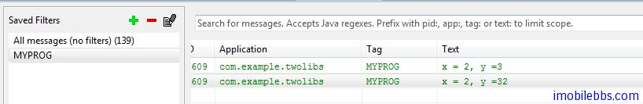

# Android NDK 開發教程七：調試

開發應用一個關鍵的步驟是調試，對於 NDK 的  C 代碼調試有很多種方法，

- 對於和 Android 平台相關性不大的部分代碼，可以單獨創建一個 C/C++項目，編寫測試代碼，測試完成後，再編譯成 NDK 動態庫或靜態庫模塊。
- 使用 NDK-GDB，NDK-GDB 的命令行調試方法和 GDB 類似，網路有很多關於 GDB 的[教程](http://www.cs.cmu.edu/~gilpin/tutorial/)
- 使用 [Eclipse+CDT+GDB 調試 android NDK 程序](http://www.cnblogs.com/shadox/archive/2011/12/02/2272564.html) 實時調試，不過這種方法設置起來不是十分方便，調試起來需要在 GDB 和 Eclipse 之間來回切換，適合於有經驗的程序員。
- 這裡介紹一個開發嵌入式系統調試的「終極工具:-)」-printf. 開發嵌入式系統調試常用的也是最簡單的方法，是使用 printf 列印調試信息。

修改一下 [two-lib 的例子](http://www.imobilebbs.com/wordpress/?p=2924) ，使用 first.c 中的 first 函數實現一個加法計算器


這裡我們想在調用 first(int x,int y) 顯示出傳入的 x ,y 值。Android NDK 中提供了一個 Log 庫，其頭文件為 android/log.h ，可以提供 Androd Java 代碼中的 Log 功能，也是可以在 LogCat 中列印信息。

具體方法如下：

1.修改 first.c ,添加合適的列印語句

```

    #include "first.h"
    #include <android/log.h>
    
    int  first(int  x, int  y)
    {
     __android_log_print(ANDROID_LOG_INFO, "MYPROG", "x = %d, y =%d", x,y);
     return x + y;
    }

```

2.修改 android.mk 文件，添加需要鏈接的 Log 庫

```
    LOCAL_PATH:= $(call my-dir)
    
    # first lib, which will be built statically
    #
    include $(CLEAR_VARS)
    
    LOCAL_MODULE:= libtwolib-first
    LOCAL_SRC_FILES := first.c
    
    include $(BUILD_STATIC_LIBRARY)
    
    # second lib, which will depend on and include the first one
    #
    include $(CLEAR_VARS)
    
    LOCAL_MODULE:= libtwolib-second
    LOCAL_SRC_FILES := second.c
    LOCAL_LDLIBS := -llog
    LOCAL_STATIC_LIBRARIES := libtwolib-first
    
    include $(BUILD_SHARED_LIBRARY)

```

然後就可以編譯 Native C 代碼，運行這個例子，可以在 LogCat 看到列印的信息：



本例[下載](http://www.imobilebbs.com/download/android/two-libs.zip)

Tags: [Android](http://www.imobilebbs.com/wordpress/archives/tag/android), [NDK](http://www.imobilebbs.com/wordpress/archives/tag/ndk)