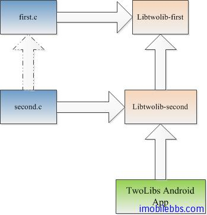

# Android NDK 開發教程四：TwoLibs 示例


隨 Android NDK 提供的另外一個例子 TwoLibs，其中有兩個庫，一個為動態庫,一個為靜態庫，最終供 Android Application 使用的動態庫使用靜態庫中的函數，如下圖所示：



其中在 first.c 中定義了一個簡單的 C 函數

```

    int first(int x, int y)
    {
     return x+y;
    }

```

second.c 調用這個函數

```

    jint
    Java_com_example_twolibs_TwoLibs_add( JNIEnv*  env,
     jobject  this,
     jint x,
     jint y )
    {
     return first(x, y);
    }

```

為了介紹動態庫調用靜態庫的方法，這個例子將兩個 C 文件編譯成兩個模塊，這是通過 android.mk  來定義的

```

    LOCAL_PATH:= $(call my-dir)
    
    # first lib, which will be built statically
    #
    include $(CLEAR_VARS)
    
    LOCAL_MODULE:= libtwolib-first
    LOCAL_SRC_FILES := first.c
    
    include $(BUILD_STATIC_LIBRARY)
    
    # second lib, which will depend on and include the first one
    #
    include $(CLEAR_VARS)
    
    LOCAL_MODULE:= libtwolib-second
    LOCAL_SRC_FILES := second.c
    
    LOCAL_STATIC_LIBRARIES := libtwolib-first
    
    include $(BUILD_SHARED_LIBRARY)

```

註：當然對於這個簡單的例子，大可不必編譯成兩個模塊。

在 Android 應用中調用動態庫（Android 應用只可以調用動態庫）

```

    public class TwoLibs extends Activity
    {
     /** Called when the activity is first created. */
     @Override
     public void onCreate(Bundle savedInstanceState)
     {
     super.onCreate(savedInstanceState);
    
     TextView  tv = new TextView(this);
     int   x  = 1000;
     int   y  = 42;
    
     // here, we dynamically load the library at runtime
     // before calling the native method.
     //
     System.loadLibrary("twolib-second");
    
     int  z = add(x, y);
    
     tv.setText( "The sum of " + x + " and " + y + " is " + z );
     setContentView(tv);
     }
    
     public native int add(int  x, int  y);
    }

```

下面就可以使用 ndk-build  ，編譯 C 代碼，然後再使用 Eclipse 編譯 Java 代碼，運行結果如下：


Tags: [Android](http://www.imobilebbs.com/wordpress/archives/tag/android), [NDK](http://www.imobilebbs.com/wordpress/archives/tag/ndk)